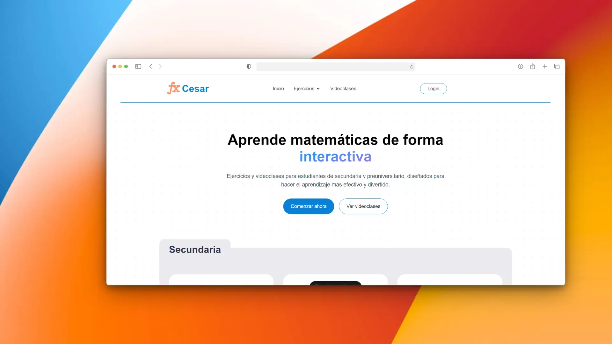

# Math WebApp 🧮

<div align="center">
<a href="https://yordis.porfolio.dev/">

</a>
<p></p>
</div>

<div align="center">


</div>

## Description
An interactive web application for practicing mathematics, designed to help students improve their math skills through practical exercises and dynamic visualizations. The application allows users to solve math problems, verify their answers, and track their progress.

## Features
- ✨ Intuitive and user-friendly interface
- 🎯 Interactive math exercises
- 📊 Progress tracking
- 🎨 Responsive design
- ⚡ Optimized performance with Astro

## Prerequisites
- Node.js (version 18 or higher)
- npm or pnpm

## Installation
1. Clone the repository

## Usage
Once the development server is running, open your browser and visit:
```bash
http://localhost:4321
```

## Project Structure
```
math-webapp/
├── src/
│   ├── components/
│   ├── layouts/
│   ├── pages/
│   └── styles/
├── public/
├── astro.config.mjs
└── package.json
```

## Technologies Used
- [Astro](https://astro.build)
- HTML/CSS
- JavaScript

## Project Status
Active development 🚧

